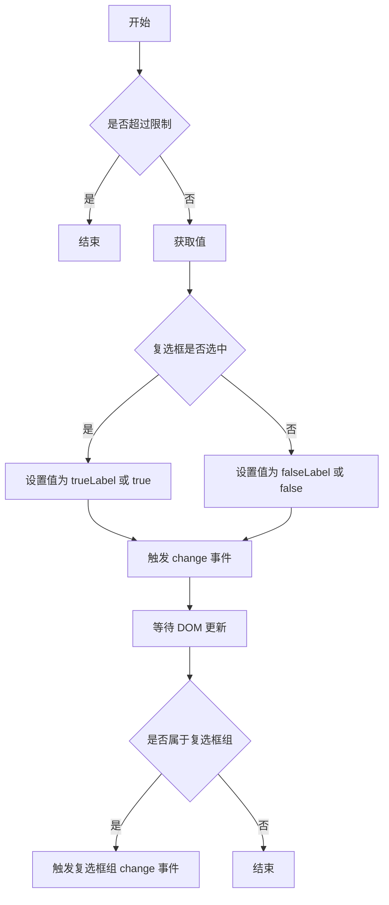
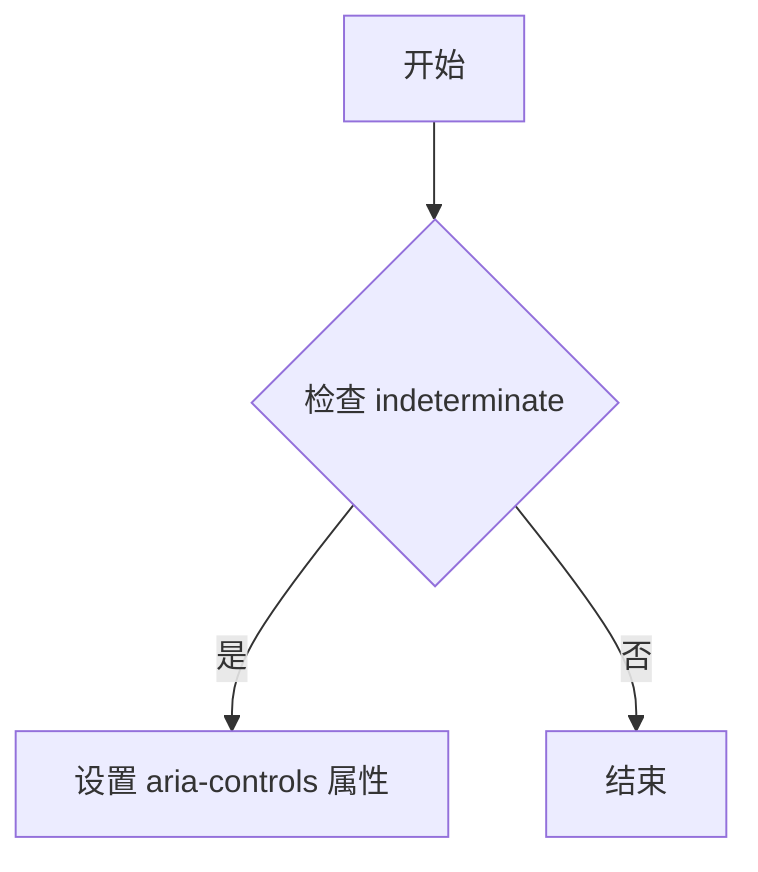

## 为什么要在nextTick中判断若是复选框组，才触发复选框组的change事件？

### 解释

在 `handleChange` 方法中，使用 `this.$nextTick` 包裹复选框组的 `change` 事件触发逻辑的原因主要有以下几点：

1. **确保DOM更新完成**：`this.$nextTick` 确保在当前操作完成后，Vue 已经完成了对 DOM 的更新。这样可以保证在触发复选框组的
   `change` 事件时，相关的 DOM 元素和状态已经是最新的。

2. **同步状态**：复选框的状态变化（如选中或取消选中）需要先同步到组件的内部状态和 DOM
   中。只有在这些更新完成后，才能正确地将最新的状态传递给复选框组，以确保复选框组能够接收到准确的状态信息。

3. **避免并发问题**：如果不在 `this.$nextTick` 中处理，可能会导致在复选框状态还未完全更新的情况下就触发复选框组的 `change`
   事件，从而引发潜在的并发问题或状态不一致的情况。

4. **优化性能**：通过 `this.$nextTick` 延迟执行，可以让 Vue 更好地批量处理 DOM 更新，减少不必要的重绘和回流，提升性能。

### 控制流图 (CFG)



### 进一步解释

- **I[等待 DOM 更新]**：使用 `this.$nextTick` 确保所有相关的 DOM 更新已经完成。
- **J{是否属于复选框组}**：检查当前复选框是否是复选框组的一部分。
- **K[触发复选框组 change 事件]**：如果是复选框组的一部分，则触发复选框组的 `change` 事件，确保复选框组能够接收到最新的状态信息。

通过这种方式，代码确保了复选框的状态和 DOM 更新是同步的，并且避免了可能的状态不一致问题。

## 设置 `aria-controls` 属性的原因

在 Vue 组件中，设置 `aria-controls` 属性的主要目的是为了增强可访问性（Accessibility）。具体来说：

- **`aria-controls`** 是一个 ARIA（Accessible Rich Internet
  Applications）属性，用于指示当前元素控制或影响的其他元素。通过设置这个属性，屏幕阅读器等辅助技术可以更好地理解页面结构和交互逻辑。

- 在这段代码中，当 `this.indeterminate` 为真时，表示复选框处于不确定状态（例如部分选中）。此时设置 `aria-controls` 属性为
  `this.controls` 的值，可以帮助辅助技术识别并告知用户该复选框与哪些其他元素相关联，从而提高用户体验。

### 控制流图



该流程图展示了代码的逻辑控制流，首先检查 `indeterminate` 是否为真，如果是则设置 `aria-controls`
属性，否则直接结束。设置此属性有助于提升组件的可访问性。

## 为什么使用watch而不是在事件方法中处理？

### 代码解释

这段代码的功能是监听 `value` 属性的变化。当 `value` 发生变化时，调用 `this.dispatch` 方法，向父组件 `ElFormItem` 派发一个名为
`el.form.change` 的事件，并传递新的 `value` 值。

### 使用 `watch` 而不是在事件方法中处理的原因

1. **响应属性变化**：`watch` 专门用于监听数据的变化并执行相应的操作。对于 `value` 这样的属性，使用 `watch` 可以确保每次
   `value` 发生变化时都能触发特定逻辑。

2. **解耦逻辑**：将监听逻辑放在 `watch` 中可以更好地解耦业务逻辑。如果在事件方法中处理，可能会导致事件方法变得复杂且难以维护。

3. **自动触发**：`watch` 会在组件初始化时自动监听属性的变化，而不需要手动触发。相比之下，事件方法需要依赖具体的用户交互或其他显式调用来触发。

4. **性能优化**：`watch` 提供了更细粒度的控制，例如可以设置 `immediate` 和 `deep` 选项来优化性能和行为。

## 为何先emit然后才赋值？
### 解释

在 Vue 组件中，`this.$emit('input', val)` 和 `this.selfModel = val` 的顺序安排是有意为之的，主要出于以下几点考虑：

1. **父组件优先处理逻辑**：
    - 通过先触发 `input` 事件 (`this.$emit('input', val)`)，可以让父组件有机会首先处理这个值的变化。父组件可能会根据新的值执行一些额外的逻辑或验证。

2. **避免不必要的更新**：
    - 如果先更新本地状态 (`this.selfModel = val`)，然后再触发事件，可能会导致组件内部的状态和父组件传递的状态不同步，尤其是在父组件有复杂的状态管理或验证逻辑时。

3. **保持一致性**：
    - 在 Vue 的双向绑定场景中（如 `v-model`），确保父组件的状态总是最先被更新，可以避免潜在的竞争条件和不一致问题。

### 具体代码解释

```javascript
this.$emit('input', val);
this.selfModel = val;
```


- **`this.$emit('input', val)`**：通知父组件当前复选框的值已经改变，并将新的值传递给父组件。父组件可以根据需要处理这个变化。

- **`this.selfModel = val`**：更新当前组件内部的状态，使其与父组件传递的新值保持一致。

这种顺序确保了父组件有机会在子组件更新其内部状态之前进行必要的处理，从而保持数据流的一致性和可预测性。
