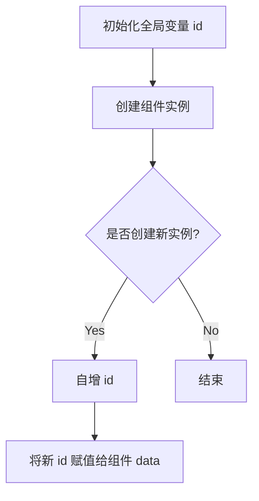

## `img-empty.vue`这里为啥要定义id

### 代码解释

在这段代码中，`id` 的定义和使用是为了为每个 `ImgEmpty` 组件实例生成一个唯一的标识符。具体原因如下：

- **全局唯一性**：通过定义一个全局变量 `id` 并在每次创建组件实例时自增，确保每个组件实例都有一个唯一的 `id`，避免了不同实例之间的
  `id` 冲突。
- **状态管理**：将 `id` 存储在组件的 `data` 中，使得每个实例都可以访问并使用这个唯一的标识符，便于后续的状态管理和操作。

### 为什么需要定义 `id`

1. **区分实例**：当页面中有多个 `ImgEmpty` 组件实例时，`id` 可以帮助区分不同的实例，方便进行特定的操作或样式处理。
2. **事件绑定和交互**：在某些情况下，`id` 可用于事件绑定、DOM 操作或其他与特定实例相关的逻辑。
3. **调试和日志记录**：唯一的 `id` 有助于在调试或日志记录时快速定位到具体的组件实例。

### 控制流图

### 解释

- **A**：初始化全局变量 `id`，初始值为 0。
- **B**：创建组件实例时进入逻辑。
- **C**：判断是否需要创建新实例（每次创建都会进入此逻辑）。
- **D**：自增 `id`，即 `id = id + 1`。
- **E**：将新的 `id` 值赋给组件的 `data` 属性。
- **F**：结束流程。

通过这种方式，`id` 确保了每个 `ImgEmpty` 组件实例的唯一性和可区分性。
